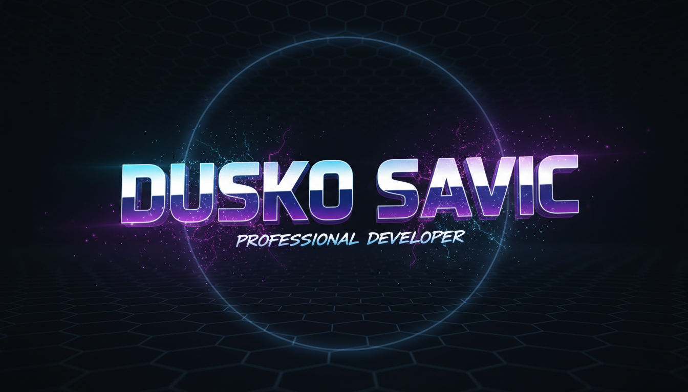
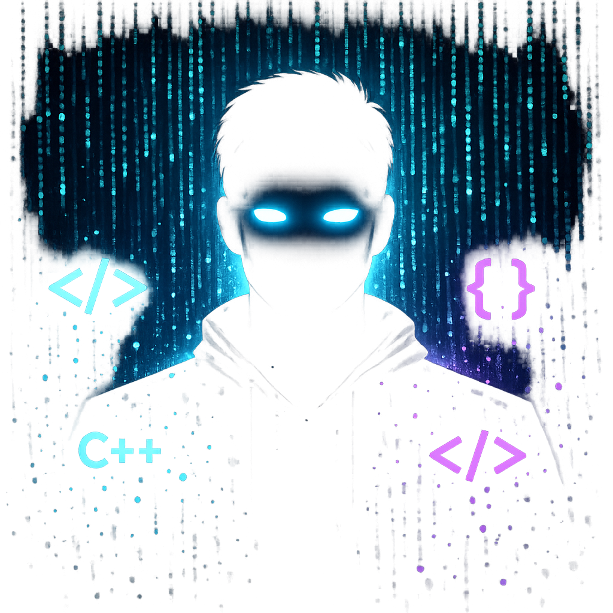
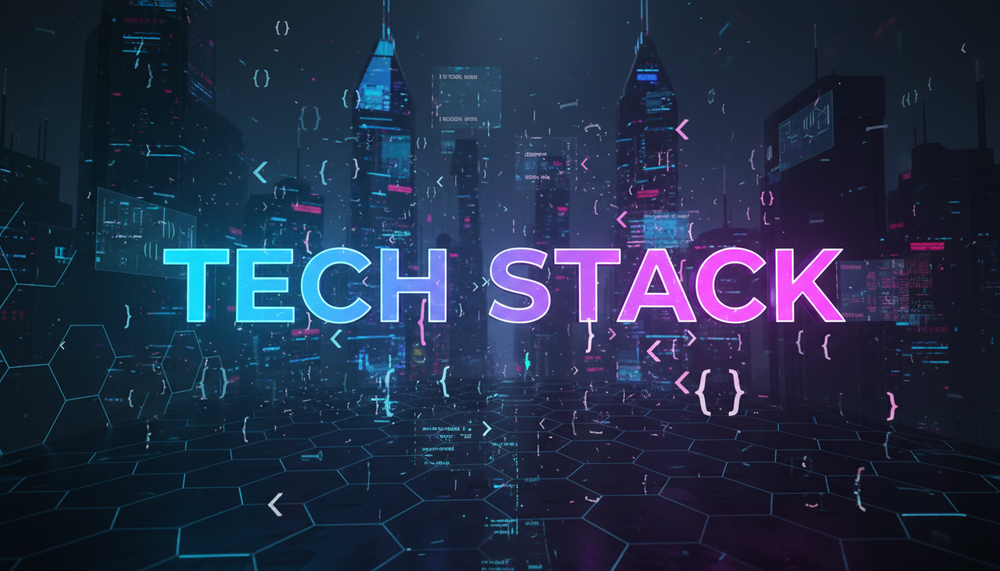
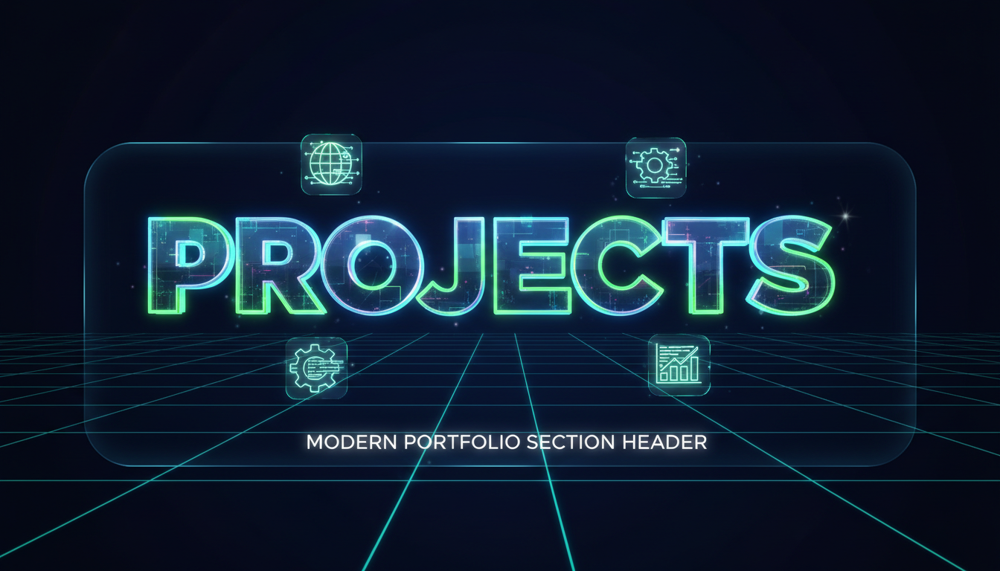
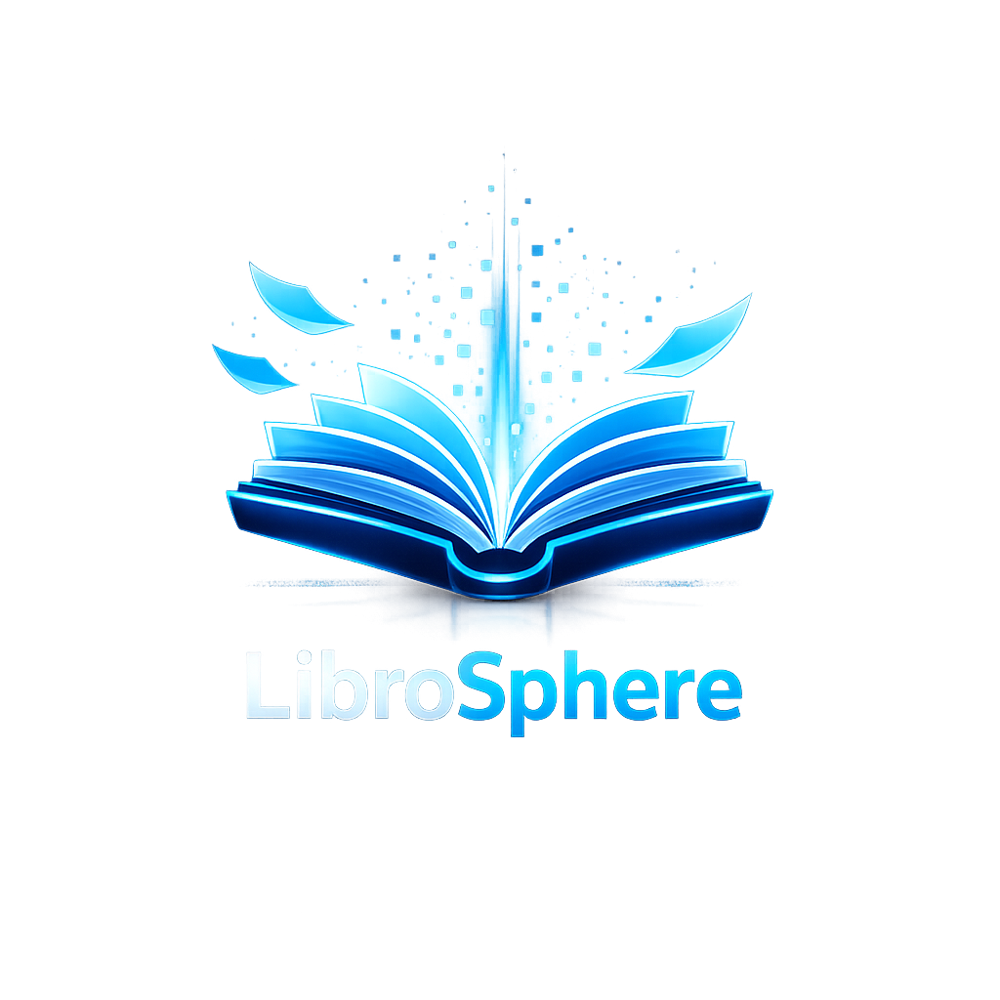
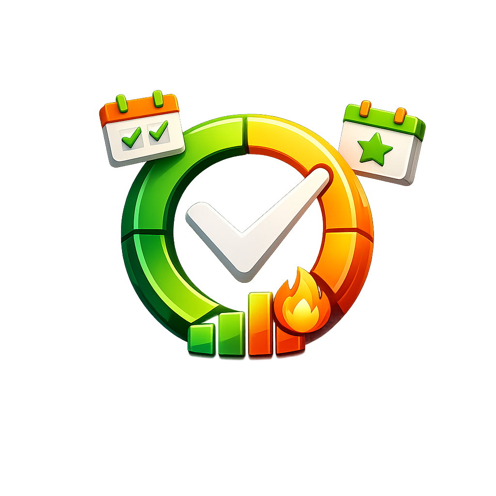
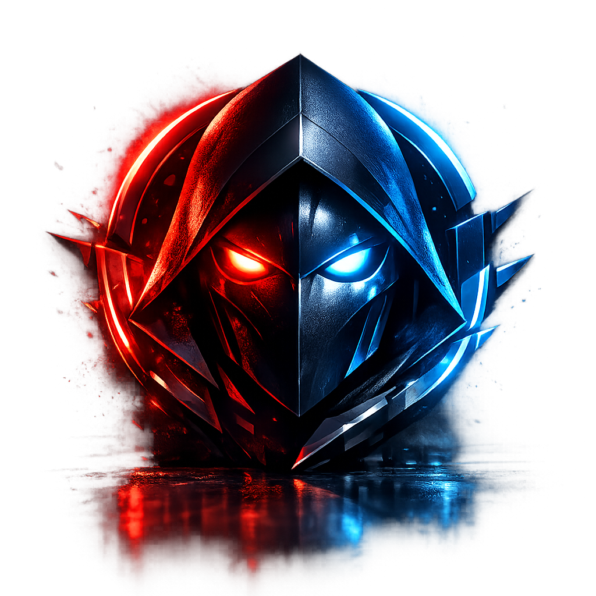
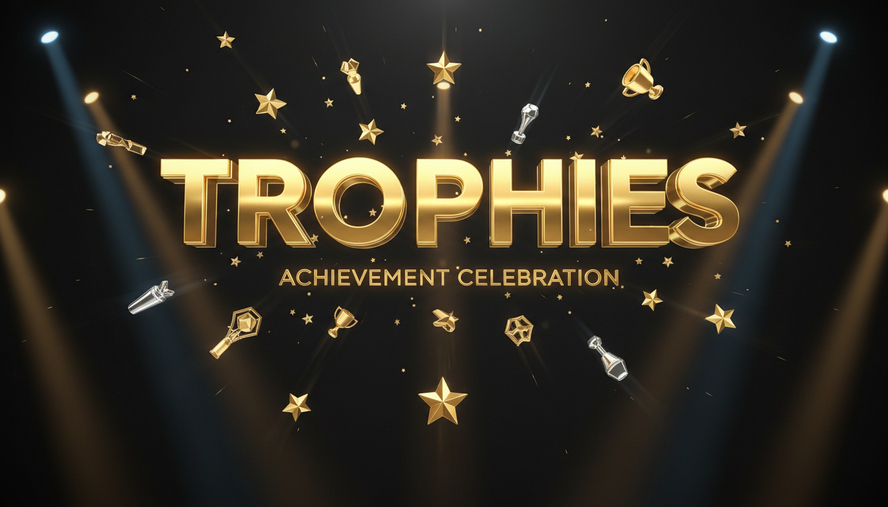
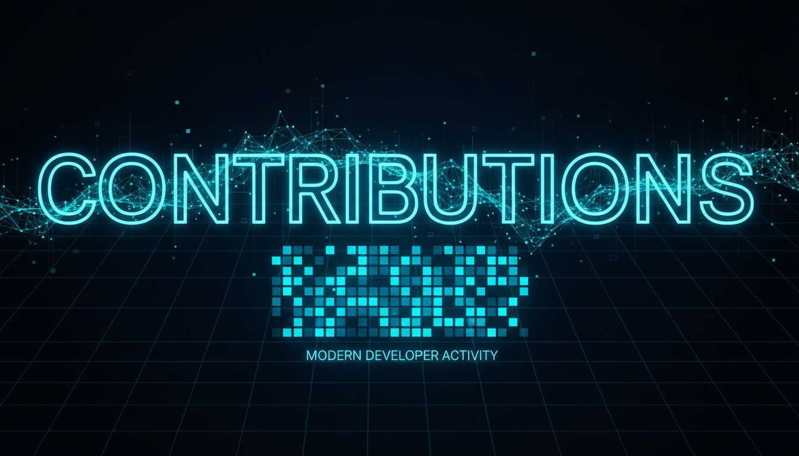
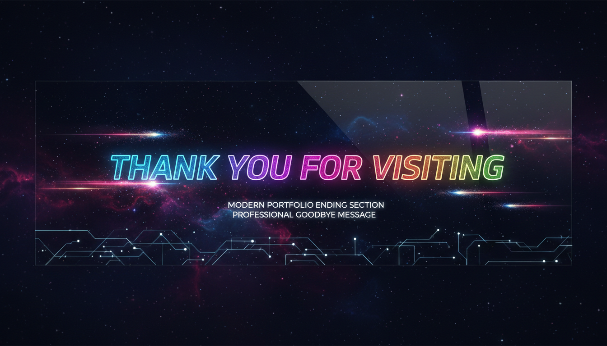

<!-- ═══════════════════════════════════════════════════════════════════════════════ -->
<!-- ║                    🚀 ULTIMATE MODERN GITHUB PROFILE README 🚀                 ║ -->
<!-- ║                         Created with 💙 by Dusko Savic                          ║ -->
<!-- ═══════════════════════════════════════════════════════════════════════════════ -->

<!-- ═══════════════════════════════════════════════════════════════════════════════ -->
<!-- ║                              🌟 MAIN HEADER                                    ║ -->
<!-- ═══════════════════════════════════════════════════════════════════════════════ -->

  

<!-- Dynamic Typing Animation -->

  

<!-- Profile Metrics -->

  
  
  

<!-- Animated Divider -->

  

<!-- ═══════════════════════════════════════════════════════════════════════════════ -->
<!-- ║                              👤 ABOUT ME SECTION                               ║ -->
<!-- ═══════════════════════════════════════════════════════════════════════════════ -->

  

<!-- Avatar + slike -->

  
  &nbsp;&nbsp;&nbsp;
  

  
  &nbsp;
  
  &nbsp;
  

  

  
  

---

### 👨‍💻 Who Am I?

| | |
|---|---|
| 🧑 **Name** | Dusko Savic |
| 📍 **Location** | 🇧🇦 Bosnia & Herzegovina |
| 💼 **Role** | Full-Stack Developer |

---

### 🚀 What I Work With

| Category | Technologies |
|---|---|
| **Languages** | `C#` `TypeScript` `Dart` `C++` `SQL` `HTML/CSS` |
| **Frameworks** | `.NET Core` `Angular` `Flutter` `Unreal Engine 5` `Entity Framework` |

---

### 🔥 Currently Building

| Project | Description |
|---|---|
| 📚 **LibroSphere** | Clean Architecture Library Platform |
| 🎓 **EduConnect** | Real-time Education Platform |
| 🎮 **UE5 Game** | Social Deduction Multiplayer Game |

---

### 🌱 Currently Learning

| | |
|---|---|
| 📖 | Clean Architecture Patterns |
| ⚡ | RxJS & Angular Material |
| 🌐 | SignalR Real-time Communication |
| 🎲 | UE5 Multiplayer Networking |

---

### 🎯 Quick Facts

| | |
|---|---|
| 🎓 **Education** | Bachelor's in Software Engineering — University "Džemal Bijedić" of Mostar, FIT |
| 💼 **Passion** | Clean Architecture, Cross-Platform Apps, Game Dev |
| 📫 **Contact** | duskosavicbn3@gmail.com |
| ⚡ **Fun Fact** | *I debug code faster than I find my keys!* 🔑 |

<!-- Animated Divider -->

  

<!-- ═══════════════════════════════════════════════════════════════════════════════ -->
<!-- ║                           🛠️ TECH STACK SECTION                               ║ -->
<!-- ═══════════════════════════════════════════════════════════════════════════════ -->

  

<!-- Skill Icons Grid -->
<h3 align="center">💻 Languages & Frameworks</h3>

  

<h3 align="center">🛠️ Tools & Platforms</h3>

  

<!-- Animated Tech Badges -->

  
  
  
  
  
  

  
  
  
  
  

<!-- Animated Divider -->

  

<!-- ═══════════════════════════════════════════════════════════════════════════════ -->
<!-- ║                        🎯 HIGHLIGHTED PROJECTS SECTION                         ║ -->
<!-- ═══════════════════════════════════════════════════════════════════════════════ -->

  

<!-- ═══════════════════════════════════════════════════════════════════════════════ -->
<!-- ║                           📚 PROJECT 1: LIBROSPHERE                            ║ -->
<!-- ═══════════════════════════════════════════════════════════════════════════════ -->

<table align="center" width="100%" style="background: linear-gradient(135deg, #1a1a2e 0%, #16213e 100%); border-radius: 20px;">
  <tr>
    <td width="25%" align="center" valign="middle">
      
    </td>
    <td width="75%" valign="top">
      <h3>📚 LibroSphere</h3>
      
<strong>🎯 Clean Architecture Library Platform</strong>

      
Online library platform for reading and purchasing books — Full-stack Web & Mobile application with integrated e-book reader, user authentication, and payment processing.

      

        
        
        
        
        
      

      

        
        
      

    </td>
  </tr>
</table>

 

<!-- ═══════════════════════════════════════════════════════════════════════════════ -->
<!-- ║                           🎓 PROJECT 2: EDUCONNECT                             ║ -->
<!-- ═══════════════════════════════════════════════════════════════════════════════ -->

<table align="center" width="100%" style="background: linear-gradient(135deg, #1a1a2e 0%, #16213e 100%); border-radius: 20px;">
  <tr>
    <td width="75%" valign="top">
      <h3>🎓 EduConnect </h3>
      
<strong>🎯 Real-time Education Platform</strong>

      
Connects students with tutors for one-on-one and group sessions. Features real-time video calls, chat, screen sharing, and interactive whiteboard using SignalR.

      

        
        
        
        
        
      

      

        
        
      

    </td>
    <td width="25%" align="center" valign="middle">
      
    </td>
  </tr>
</table>

 

<!-- ═══════════════════════════════════════════════════════════════════════════════ -->
<!-- ║                           📊 PROJECT 3: HABIT TRACKER                          ║ -->
<!-- ═══════════════════════════════════════════════════════════════════════════════ -->

<table align="center" width="100%" style="background: linear-gradient(135deg, #1a1a2e 0%, #16213e 100%); border-radius: 20px;">
  <tr>
    <td width="25%" align="center" valign="middle">
      
    </td>
    <td width="75%" valign="top">
      <h3>📊 Habit Tracker </h3>
      
<strong>🎯 Track & Visualize Daily Habits</strong>

      
Track and visualize daily habits and long-term goals with smart notifications, streak counters, progress charts, and achievement badges.

      

        
        
        
        
      

      

        
      

    </td>
  </tr>
</table>

 

<!-- ═══════════════════════════════════════════════════════════════════════════════ -->
<!-- ║                           🎮 PROJECT 4: UE5 GAME                               ║ -->
<!-- ═══════════════════════════════════════════════════════════════════════════════ -->

<table align="center" width="100%" style="background: linear-gradient(135deg, #1a1a2e 0%, #16213e 100%); border-radius: 20px;">
  <tr>
    <td width="75%" valign="top">
      <h3>🎮 Social Deduction Game </h3>
      
<strong>🎯 Multiplayer Mystery Game</strong>

      
Original social game with hidden roles, mystery-solving, and team strategy. Built with Unreal Engine 5 featuring multiplayer networking, voice chat, and dynamic gameplay.

      

        
        
        
        
      

      

        
      

    </td>
    <td width="25%" align="center" valign="middle">
      
    </td>
  </tr>
</table>

<!-- Animated Divider -->

  

<!-- ═══════════════════════════════════════════════════════════════════════════════ -->
<!-- ║                          📊 GITHUB STATS SECTION                               ║ -->
<!-- ═══════════════════════════════════════════════════════════════════════════════ -->

<!-- GitHub Stats Cards -->

  
  

<!-- GitHub Activity Graph -->

  

<!-- Top Languages -->

  
  

<!-- Animated Divider -->

  

<!-- ═══════════════════════════════════════════════════════════════════════════════ -->
<!-- ║                          🏆 TROPHIES SECTION                                   ║ -->
<!-- ═══════════════════════════════════════════════════════════════════════════════ -->

  

  

<!-- Animated Divider -->

  

<!-- ═══════════════════════════════════════════════════════════════════════════════ -->
<!-- ║                       🐍 CONTRIBUTION SNAKE ANIMATION                          ║ -->
<!-- ═══════════════════════════════════════════════════════════════════════════════ -->

  

  <picture>
    <source media="(prefers-color-scheme: dark)" srcset="https://raw.githubusercontent.com/RokyMoi/RokyMoi/output/github-contribution-grid-snake-dark.svg" />
    <source media="(prefers-color-scheme: light)" srcset="https://raw.githubusercontent.com/RokyMoi/RokyMoi/output/github-contribution-grid-snake.svg" />
    
  </picture>

<!-- Animated Divider -->

  

<!-- ═══════════════════════════════════════════════════════════════════════════════ -->
<!-- ║                          📫 CONNECT WITH ME SECTION                            ║ -->
<!-- ═══════════════════════════════════════════════════════════════════════════════ -->

  

  
  
  
  
  
  

<!-- Animated Divider -->

  

<!-- ═══════════════════════════════════════════════════════════════════════════════ -->
<!-- ║                          💭 QUOTE OF THE DAY                                   ║ -->
<!-- ═══════════════════════════════════════════════════════════════════════════════ -->

<h2 align="center">
  
  <b>Quote of the Day</b>
</h2>

  

<!-- Animated Divider -->

  

<!-- ═══════════════════════════════════════════════════════════════════════════════ -->
<!-- ║                          🎮 FUN FACTS SECTION                                  ║ -->
<!-- ═══════════════════════════════════════════════════════════════════════════════ -->

<h2 align="center">
  
  <b>Fun Facts</b>
</h2>

  
  
  
  
  

<!-- Random Joke -->

  

<!-- Animated Divider -->

  

<!-- ═══════════════════════════════════════════════════════════════════════════════ -->
<!-- ║                              🙏 THANK YOU FOOTER                               ║ -->
<!-- ═══════════════════════════════════════════════════════════════════════════════ -->

  

  <b>⭐ Star my repositories if you find them helpful! ⭐</b>

  
  
  
  

<!-- ═══════════════════════════════════════════════════════════════════════════════ -->
<!-- ║                              END OF README                                     ║ -->
<!-- ║                         Made with 💙 by Dusko Savic                            ║ -->
<!-- ═══════════════════════════════════════════════════════════════════════════════ -->
